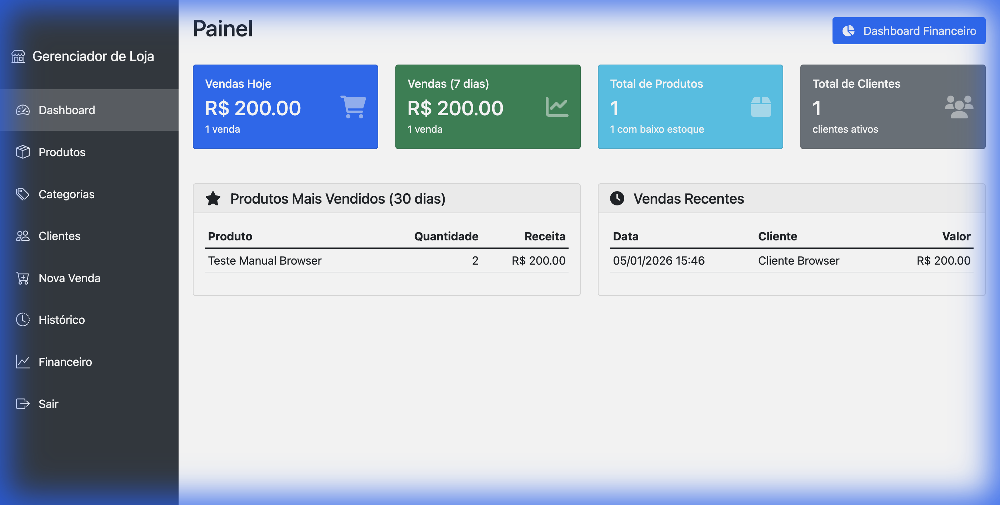
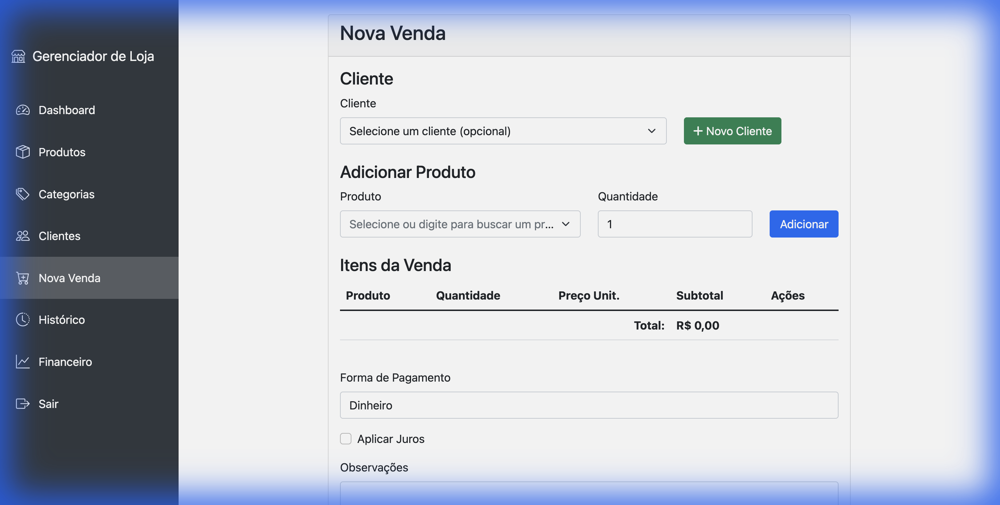
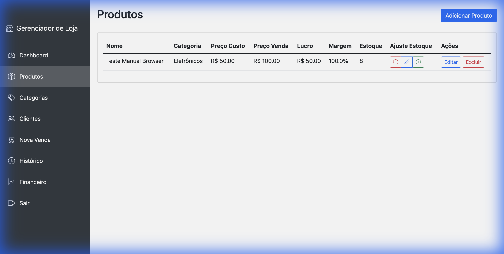
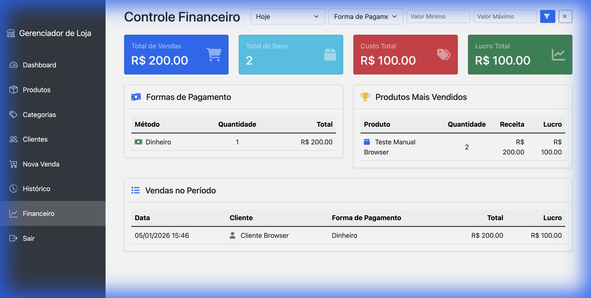

# Sistema de Gerenciamento de Loja

Um sistema robusto para gerenciamento de vendas, estoque e controle financeiro, desenvolvido em Flask (Python).



## 🚀 Funcionalidades Principais

### 💰 Gestão de Vendas
- **Caixa de Venda Ágil**: Adicione produtos via busca rápida, controle estoque em tempo real.
- **Múltiplos Pagamentos**: Suporte a Dinheiro, Cartão (Crédito/Débito) e PIX.
- **Cancelamento Seguro**: Reverte estoque automaticamente ao cancelar uma venda.



### 📦 Controle de Estoque
- **Produtos e Categorias**: Organização completa de itens.
- **Ajuste Manual**: Correção rápida de estoque via interface.
- **Precificação**: Controle de Custo vs Venda para cálculo de margem.



### 📈 Dashboard Financeiro
- **Visão em Tempo Real**: Lucro, Receita e Custos.
- **Filtros Inteligentes**: Analise dados de Hoje, Últimos 30 dias ou períodos personalizados.
- **Métricas de Pagamento**: Veja qual forma de pagamento é mais utilizada.



## 🛠️ Instalação e Execução

### Pré-requisitos
- Python 3.8+
- Git

### Passo a Passo

1. **Clone o repositório**
   ```bash
   git clone https://github.com/danielthejoker18/store_app.git
   cd store_app
   ```

2. **Configure o Ambiente Virtual**
   ```bash
   python -m venv venv
   source venv/bin/activate  # Linux/Mac
   # ou
   .\venv\Scripts\activate   # Windows
   ```

3. **Instale as Dependências**
   ```bash
   pip install -r requirements.txt
   ```

4. **Prepare o Banco de Dados**
   ```bash
   # Cria as tabelas e popula com dados iniciais de teste
   python run_dev.py
   ```
   *(Responda 's' quando solicitado)*

5. **Execute a Aplicação**
   ```bash
   flask run
   ```
   Acesse: `http://127.0.0.1:5000`

### Credenciais Padrão
- **Usuário**: `admin`
- **Senha**: `admin`

## 🗂️ Estrutura do Projeto

O projeto foi refatorado para seguir uma arquitetura modular:

```text
store_app/
├── app/
│   ├── routes/          # Rotas separadas por Blueprint (auth, main, products, etc.)
│   ├── templates/       # Interface do usuário (Bootstap 5)
│   ├── forms.py         # Formulários WTForms com validação
│   └── models.py        # Modelos SQLAlchemy (com Decimal para precisão financeira)
├── tests/               # Suíte de testes (Pytest)
├── screenshots/         # Imagens da documentação
├── run_dev.py           # Script para resetar/popular banco de dados
└── requirements.txt
```

## ✅ Qualidade de Código
O projeto conta com uma suíte de testes abrangente:
- **Unitários**: Modelos e regras de negócio.
- **Integração**: Fluxos de venda, login e CRUD.
- **Avançados**: Cancelamentos, filtros financeiros e concorrência.

Para rodar os testes:
```bash
pytest tests/
```

## 📄 Licença
Distribuído sob a licença MIT. Veja `LICENSE` para mais informações.
